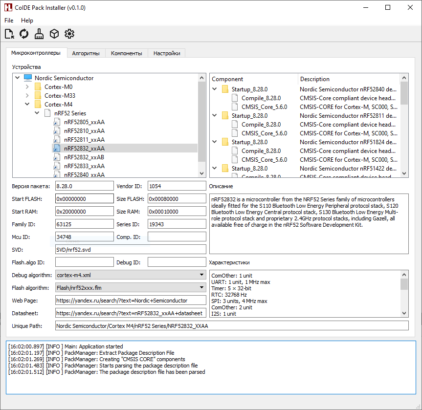

## CoIDE Pack Installer

**Version:** 0.1.0

Утилита для установки и управления CMSIS-пакетами (Device Family Pack, Software Pack) в среде разработки CoIDE. Позволяет автоматизировать процесс загрузки и установки пакетов для ARM-микроконтроллеров.



### Возможности программы
- Загрука пакетов CMSIS Pack (\*.pack) и базовый разбор Package Description File (\*.pdsc)
- Интеграция новых ARM-микроконтроллеров в среду CoIDE на основе описания pdsc
- Распаковка и установка пакетов в CoIDE
- Добавление компонентов к микроконтроллерам
- Поддержка командной строки (CLI) для автоматизации и интеграции

### Проверенные пакеты

На текущем этапе разработки приложение протестировано и корректно работает со следующими пакетами:

- `NordicSemiconductor.nRF_DeviceFamilyPack` (версии 8.11.1, 8.15.4, 8.28.0)

> **Примечание:** Для пакетов других производителей работа не гарантируется. Возможны ошибки при разборе `.pdsc` или интеграции компонентов.

### Требования
- Windows 7/10/11
- CoIDE 1.7.8

### Сборка из исходников

Необходимые инструменты для сборки под Windows (MinGW):
1. Qt 5.7.1+
2. [Git for Windows](https://git-scm.com/downloads/win)
3. Компилятор MinGW (поставляется в комплекте с Qt)

> **Примечание:** Для успешного выполнения приведенного ниже набора команд добавьте в переменную **PATH** путь к компилятору MinGW (**C:\Qt\Qt5.7.1\Tools\mingw530_32\bin\\**), а так же путь к библиотекам и утилитам Qt (**C:\Qt\Qt5.7.1\5.7\mingw53_32\bin\\**)

> Для успешной сборки и работы приложения в ОС Windows 7 должны быть установлены обновления KB976932 и KB2533623

В командной строке Windows (cmd.exe) выполнить команды:
```batch
git clone https://github.com/unsi9ned/coide-pack-installer
cd coide-pack-installer
qmake CoIDE_PackInstaller.pro
mingw32-make
windeployqt release
xcopy utils release\utils /E /I /Y
release\CoIDE_PackInstaller.exe
```

### Использование
```batch
Usage: CoIDE_PackInstaller.exe [options]

Options:
  -?, -h, --help          Displays this help.
  -v, --version           Displays version information.
  -d, --ide <ide_path>    Path to CoIDE directory
  -p, --pack <pack_path>  Path to Device Family Package (*.pack, *.jpack)
  -l, --devices           Uploading a DFP and displaying a list of devices
  -c, --components        Uploading a DFP and displaying a list of components
  -i, --install           Install Device Family Package in CoIDE
  --optimize-db           Optimize database (clean unused tables and obsolete
                          data)
```